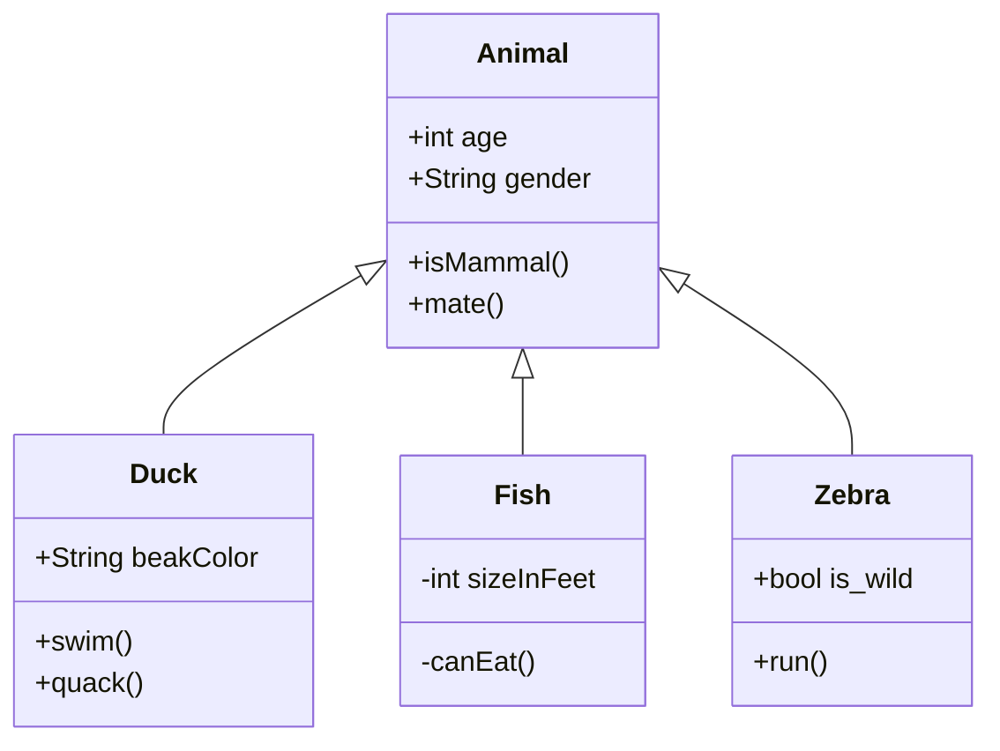
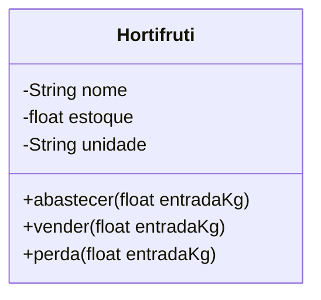

## Exercicio aula 4

Para cada uma das imagens contidas nos slides seguintes, faça o que
se pede nos itens seguintes.

- a)  Faça os diagramas UML de três classes, cujos possíveis objetos
estão exibidos nas imagens. Cada classe deve ter três atributos e
três métodos, sem contar os métodos de acesso.
- b) Implemente as classes definidas no item a em Java.
- c) Construa uma classe principal, que deve conter o método main para
instanciação de objetos e testes das classes codificadas no item b

Ali temos 3 imagens: uma farmácia, uma feira e um salão de beleza.

   